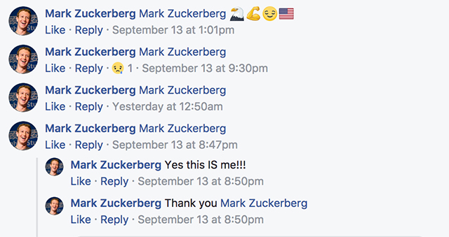

# I'm Mark Zuckerberg

"I'm Mark Zuckerberg" is a Chrome extension that re-imagines your
Facebook experience by replacing all your friends profile images and names 
with Mark Zuckerberg. It is not in the Chrome Store yet but aims to be soon.


### Installation

You can install this extension yourself without it being on the Chrome Store as long as you have a 
Google Chrome web browser. Instructions are as follows:

####Get a copy of this repository:

Either Dowload via the green `clone or download` button or clone from your terminal/command-line by entering the following:

```bash
$ git clone https://github.com/winstonjay/ImMarkZuckerberg.git
```

If you download via the green button you will have to un-zip the folder.

####Add to your browser extensions:

With a Chrome browser, open up the extensions page located at: `chrome://extensions`. Next, open up your the folder you just downloaded and the 
drag and drop the `chromePackage` folder into the webpage you just opened. 

####I'm Mark Zuckerberg should now be installed:

Vist [facebook.com](https://www.facebook.com/) and enjoy your new life with just you, yourself and Mark.



## Contributions

Due to the changing and dynamic nature of facebook.com the list of element selectors used in the exstension need constant maintenance to make replace as many user instances as possible. This isn't complicated but just requires hunting out elements in the Facebook DOM. Contributions are more than welcome and it would be appreciated if any instances where you feel a username or user image should be replaced isn’t.
